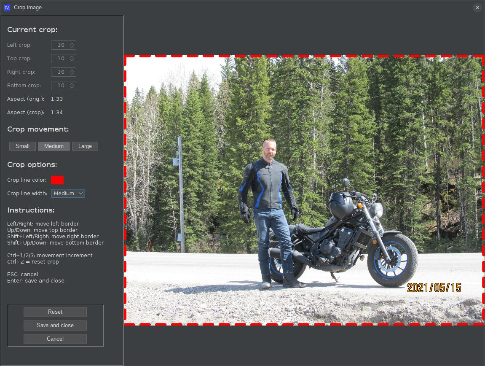
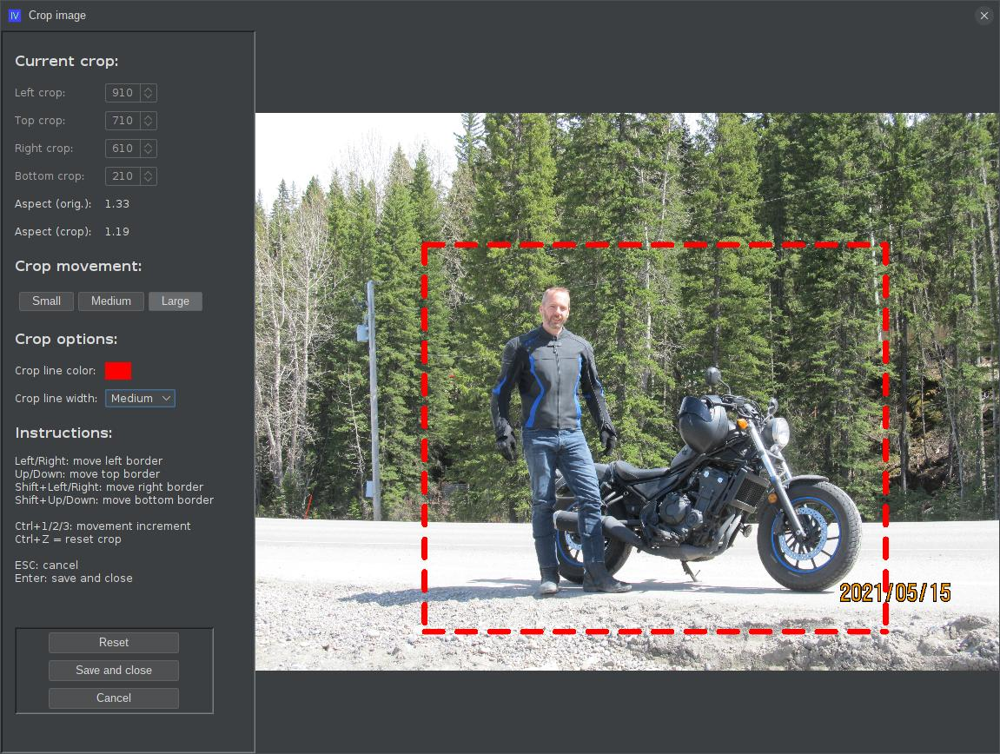

# ext-iv-image-crop
An extension for ImageViewer to allow custom cropping of selected image

## What is this?

This is an extension for the [ImageViewer](https://github.com/scorbo2/imageviewer) application that allows you to apply a custom crop to the selected image.

## How do I get it?

### Option 1: automatic download and install

**New!** Starting with the 2.3 release of ImageViewer, you no longer have to manually build and install application extensions!
Now, you can visit the "Available" tab in the new and improved extension manager dialog:


Select "Crop image" from the list on the left and then hit the "Install" button in the top right.
If you decide later to remove the extension, come back to the extension manager dialog, select "Crop image"
from the list on the left, and hit the "Uninstall" button in the top right. The application will prompt to restart.
It's just that easy!

### Option 2: manual download and install

You can manually download the extension jar:
[ext-iv-image-crop-3.0.0.jar](https://www.corbett.ca/apps/ImageViewer/extensions/3.0/ext-iv-image-crop-3.0.0.jar)

Save it to your ~/.ImageViewer/extensions directory and restart the application.

### Option 3: build from source

You can clone this repo and build the extension jar with Maven (Java 17 or higher required):

```shell
git clone https://github.com/scorbo2/ext-iv-image-crop.git
cd ext-iv-image-crop
mvn package

# Copy the result to extensions dir:
cp target/ext-iv-image-crop-3.0.0.jar ~/.ImageViewer/extensions/
```

## Okay, it's installed, now how do I use it?

Once ImageViewer has restarted, you can select "Crop image" from the "Edit" menu.
That brings up the cropping dialog:



The dashed red border indicates the current crop area. Use the arrow keys as indicated in the "Instructions" section
in the left panel to adjust the crop border. You can use the toggle buttons to control the increment by which the
crop border moves as you use the arrow keys. If you want to start over, you can hit `ctrl+z` at any time to reset
the crop back to the original image dimensions.

Notice that as you move the crop borders, the "aspect ratio" labels in the left panel update to show the
aspect ratio of the current crop, as compared to the aspect ratio of the original image. This can be useful
if your goal is to crop the image to a specific aspect ratio, or if you wish the aspect ratio of the cropped
image to match the original aspect ratio.

You can use the "crop options" controls to adjust the color of the dashed crop line, and also to adjust
its thickness, to make it more or less visually obvious in the overlay.

Eventually, you will get the crop to where you want it:



When you are satisfied with the crop, hit the "Save and close" button, or just press "enter".
You will be prompted to accept the current crop. The image is saved in place and the dialog closes automatically.

## Notes

Image cropping is currently only supported for jpeg and png images.

## Requirements

Compatible with any ImageViewer 3.x release.

## License

ImageViewer and this extension are made available under the MIT license: https://opensource.org/license/mit
